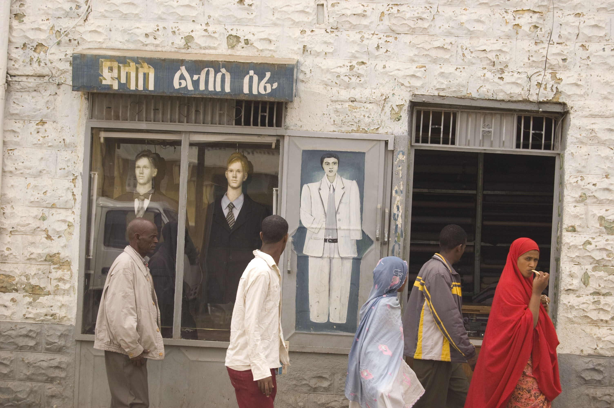

<html>
<head>
  <meta charset="utf-8">
  <link href="https://fonts.googleapis.com/css? family=Abril Fatface" rel="stylesheet">
  <link href="https://fonts.googleapis.com/css?family=Abril Fatface" rel="stylesheet">

  <title>My first website</title>
  
</head>

<body>
    
    

    <h1>This is the main page.</h1>
    

    

    
From this page you can access the other pages

    

    <ul>
      

        <li><a href="page1.html">Here is a link to your zine page</a></li>
        

        

      <li><a href="page2.html">Here is a link to your description of your zine</a></li>
        

        

      <li><a href="page3.jpg">Here is a link to page your logo</a></li>
        

      <li><a href="homework.html">Here is a link to Homework One photoshop alterego</a>
      <li><a href="homeworkpart2.html">Here is a link to Homework video</a>
      <li><a href="photoshop.html">Here is a link to after effects video</a></li>
 

